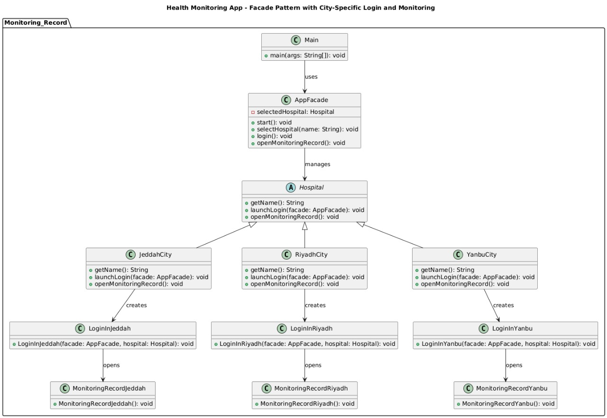

# 🩺 Applying Design Patterns in Health Monitoring App

A Java Swing-based health monitoring application designed to **demonstrate and apply five key object-oriented design patterns**: **Singleton**, **Factory Method**, **Composite**, **Facade**, and **Memento**.

---

### 🧾 Original Class Diagram (Before Applying Design Patterns)

This diagram illustrates the initial structure of the Health Monitoring App before design patterns were introduced. It helps visualize how the architecture was improved through refactoring.


---

### 🆚 Comparison: Before vs. After Design Patterns

| Aspect              | Original Design                | After Refactoring with Patterns        |
|---------------------|--------------------------------|----------------------------------------|
| Structure           | Flat and tightly coupled       | Modular and layered using patterns     |
| Reusability         | Low                            | High through interfaces and factories  |
| Maintainability     | Harder to update or extend     | Easier with pattern separation         |
| Complexity Handling | Centralized in few classes     | Distributed logically via patterns     |

---

## 🚀 Project Overview

This application allows users to securely log in and track essential health metrics via a questionnaire-based interface. It includes features such as password recovery, hierarchical doctor-patient management, support access, session management, and report saving. The project highlights how well-known design patterns can organize, simplify, and enhance application design.

---

## 📁 Architecture & Design Patterns

### 1. **Singleton Pattern**
- **Intent**: Ensure a class has only one instance and provide a global point of access.
- **Usage**: Used in the `Login` component to ensure only a single login window/session is active.
- **Benefits**:
  - Prevents multiple login dialogues.
  - Manages shared user-session data globally and efficiently.


---

### 2. **Factory Method Pattern**
- **Intent**: Defines an interface for creating an object, letting subclasses determine which class to instantiate.
- **Usage**: Used to generate variation-specific UI components (e.g., city-based login windows or health-monitoring configurations).
- **Benefits**:
  - Decouples object creation from application logic.
  - Promotes extension for future variants without modifying core code.


---

### 3. **Composite Pattern**
- **Intent**: Compose objects into tree-like structures to represent part-whole hierarchies. Clients treat individuals and compositions uniformly.
- **Usage**: `Doctor` and `Patient` implement the `HealthcareComponent` interface. Doctors can contain other doctors or patients recursively.
- **Benefits**:
  - Simplifies hierarchical relationship management.
  - Enables consistent operations over nested structures.
  - Supports scalable, complex organizational models.


---

### 4. **Facade Pattern**
- **Intent**: Provide a unified, simplified interface to a set of interfaces in a subsystem.
- **Usage**: `AppFacade` simplifies interactions among login, questionnaire, support, and report subsystems.
- **Benefits**:
  - Hides complexity of subsystems.
  - Reduces coupling between UI and back-end logic.
  - Streamlines navigation flows and orchestration.



---

### 5. **Memento Pattern**
- **Intent**: Capture and externalize an object’s internal state so it can be restored later without violating encapsulation.
- **Usage**: Used to save and restore user’s health questionnaire input or report text state in `Monitoring_Record_Window`.
- **Benefits**:
  - Enables undo/redo and recovery from accidental data loss.
  - Maintains UI state without exposing internal structure.
  - Enhances user experience by preventing loss of input.


---

## 🧰 Main Components

- `Main.java` — Application entry point.
- `Login` — Secure user authentication system.
- `ForgetPassword` — Password recovery management.
- `Monitoring_Record_Window` — Central dashboard with questionnaire logic and state management.
- `Questionnaire` — Evaluates vital health parameters and advises hospital visit necessity.
- `Support` — Provides user support options and contact info.
- `Check_Logout` — Manages logout confirmation dialogs.
- `AppFacade` — Centralized controller for subsystem coordination.
- `Doctor`, `Patient`, `HealthcareComponent` — Implements Composite Pattern.
- `Memento` & `Caretaker` classes — Encapsulate and restore application state.

---

## ✅ Benefits of Refactoring with Design Patterns

- ✅ **Modularity**
- ✅ **Extensibility**
- ✅ **Simplified Interface**
- ✅ **Robust State Handling**

---

## 🧪 Getting Started

```bash
git clone https://github.com/abmj77/Applying-Design-Patterns-In-Health-Monitoring-App.git
cd Applying-Design-Patterns-In-Health-Monitoring-App
```

## Author 
Abdulmajeed Abdullah 
